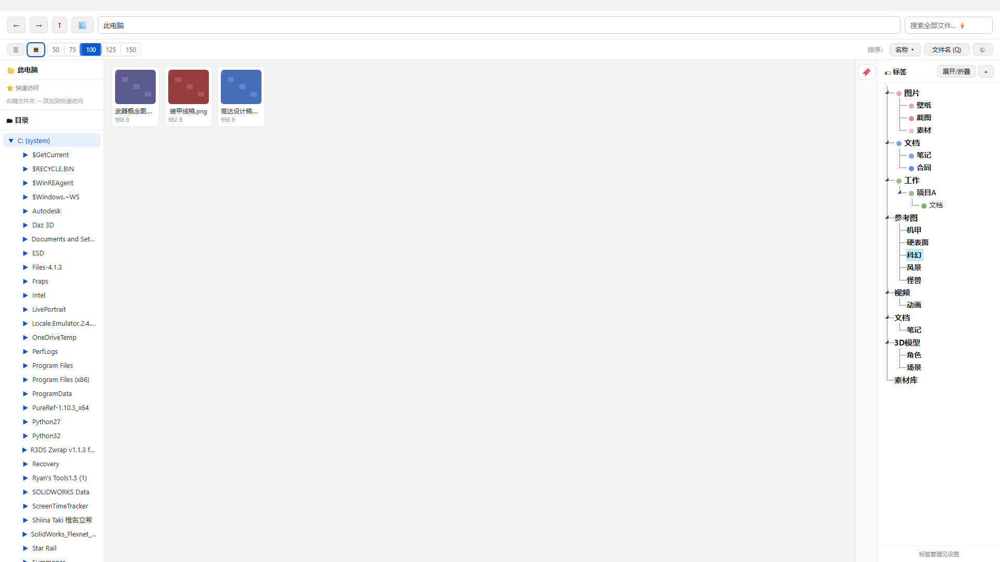

# 西煲 (Xibao)

本地文件管理器，核心是"标签而非文件夹路径"——用一棵无限级标签树，把图片、视频、文档、3D 模型乃至整个文件夹统一组织起来。

A local file manager built around a hierarchical tag tree. Organize images, videos, docs, 3D models, and even whole folders with a single tag taxonomy — instead of folder paths.

<p align="center">
  
</p>

纯本地运行，不搬移用户文件。数据存于 `%APPDATA%\Xibao\`，不依赖程序位置。唯一联网是「检查更新」（需手动点击，用于检测 GitHub 新版本）；你的文件永远不会上传。

- 🏷 无限级标签树 / Unlimited hierarchical tags (N levels)
- 📁 文件与文件夹都能打标 / Tag both files and folders
- 🔍 多标签交集(AND)/并集(OR)组合筛选 / Multi-tag filter with AND/OR
- 🔄 稳定文件标识：文件移动/重命名后标签自动跟随 / Stable file IDs: tags follow files across moves
- 💾 标签一键导出/导入（可读 JSON，损坏可恢复）/ One-click JSON backup & restore
- 🔒 全程离线、文件不上传（仅手动检查更新时联网）/ 100% offline, files never uploaded
- ⚡ Everything 搜索 + 内置本地索引 / Everything IPC + built-in local index
- 🖼 系统缩略图 + 系统文件图标（PSD/PDF/Office 也能出图）/ System thumbnails & icons
- 🆓 永久免费 / Free forever

## 功能

- **资源管理器**：文件树（系统文件夹 + 盘符）+ 网格/列表双视图 + 排序（文件夹恒在前）+ 面包屑 + 导航
  - 系统文件夹（桌面/下载/图片/视频等）接入文件树，可开关/勾选（设置 → 文件树）
  - 快速访问（右键文件夹添加到收藏，并入文件树）
  - 框选 / Ctrl / Shift 多选、右键菜单、拖拽移动
  - 文件树/标签树宽度都可拖拽调节
- **搜索**：Everything 引擎（若已安装）→ 本地索引（内置，免依赖）分层兜底
- **标签体系**：多级标签树 + 颜色标记
  - 单击 = 单标签筛选；🔖 多选筛选（and/else 两种匹配）
  - 筛选父级自动包含所有子级（不物化祖先链，无冗余/幽灵标签）
  - 标签可直接拖动调整层级/顺序，自动保存
  - 筛选方案（可保存/编辑/排序/标注颜色）
  - 多选追加标签（不覆盖原有）、批量清除标签
  - **标签异常警示区**：文件挂了"现在是父级"的标签（编辑弹窗不可勾选）时，⚠️ 异常入口列出并处理
  - **稳定文件标识**：文件被移动/重命名（即使通过资源管理器）后，标签按文件 ID 自动找回
- **备注名（Alias）**：文件/文件夹可设"只在西煲内显示"的名称，不修改真实文件名；Q 键切换显示
- **预览**：空格键 QuickLook（图片/视频/文本）
- **缩略图**：系统缩略图引擎优先（COM，PSD/PDF/Office 也出图）+ 内置视频解码回退；系统文件图标（exe 等）
- **外部写入 API**：`POST /api/v1/tags/apply` 批量打标 + 安全区路径白名单 + 审核队列（工具栏「🕓 待审核」）
- **数据安全**：标签导出/导入（含颜色）、启动自动备份、升级自动迁移旧库（迁移前自动备份）
- **检查更新**：设置里手动检查 GitHub 新版本（按下才联网）
- **帮助**：内置完整帮助文档

## 模块结构

```
src/
  common.py             公共工具（日志、数据目录、APP_VERSION 唯一版本号）
  webui/
    app.py              Flask 主程序 + Blueprint 注册 + 示例标签 + 自动备份
    routes/             按域拆分：tags / files / search / settings / external
    templates/ static/  前端（原生 JS + jsTree + jQuery + SortableJS）
  images/
    library.py          资源管理器后端（真实路径、全类型、元信息、删除/移动）
    file_id.py          稳定文件标识（st_ino+st_dev 编码、OpenFileById 反查）
    known_folders.py    系统 Known Folders（桌面/下载/图片等）
    thumbnail.py        多后端缩略图（系统 COM 优先 + PyAV 视频帧回退）
    shell_thumbnail.py  系统 COM 缩略图/图标
    tools.py            外部工具探测（7-Zip/WinRAR/Bandizip/LE/Everything）
    indexer.py          本地搜索索引
    everything_search.py Everything IPC 搜索
    detect.py           搜索能力检测
  memory/
    store.py            SQLite：标签树/关联/file_id/审核队列（数据存 %APPDATA%\Xibao）
```

## 数据位置

- 标签、搜索索引、file_index 等：`%APPDATA%\Xibao\`（不依赖 exe 位置）
- 缩略图缓存：`%LOCALAPPDATA%\Xibao\thumbnails\`

## 运行

```bash
# 方式一：源码运行（自动打开浏览器访问 http://127.0.0.1:8788）
python -m src.webui.app --port 8788

# 方式二：Windows 双击 start.bat（自动检测并打开浏览器）
```

## 安装依赖

```bash
python -m venv .venv
.venv\Scripts\pip install -r requirements.txt
```

## 运行测试

```bash
.venv\Scripts\pip install -r requirements-dev.txt
.venv\Scripts\python -m pytest tests -q
```

## exe 打包

```bash
python build_package.py  # onedir + Inno Setup 安装包
```

打包说明：
- 安装包图标：项目根目录 `icon.ico`（可用环境变量 `XIBAO_ICON` 覆盖）
- Inno Setup 编译器：环境变量 `ISCC` 指定路径，或放 `inno\ISCC.exe`
- 版本号唯一来源：`src/common.py` 的 `APP_VERSION`（health / 更新检查 / 打包共用）
- 前端 JS/CSS 改动后更新 `images.html` 的 `?v=N` 版本号（防浏览器缓存）
